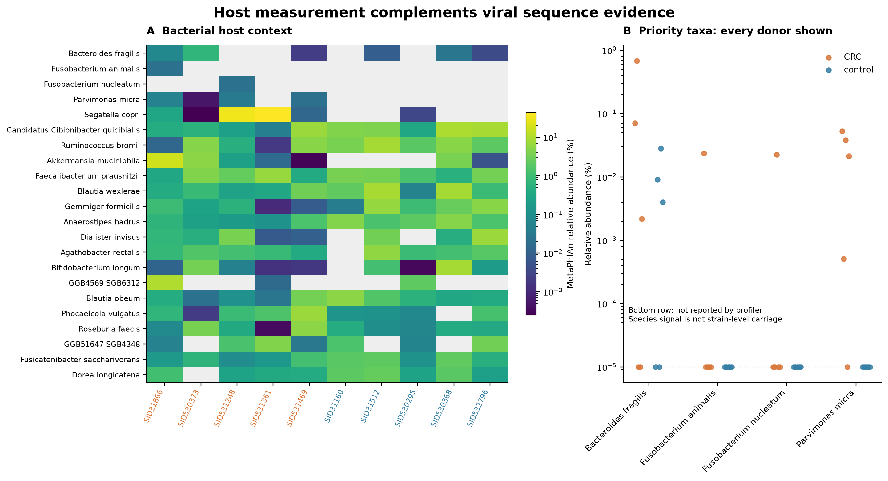
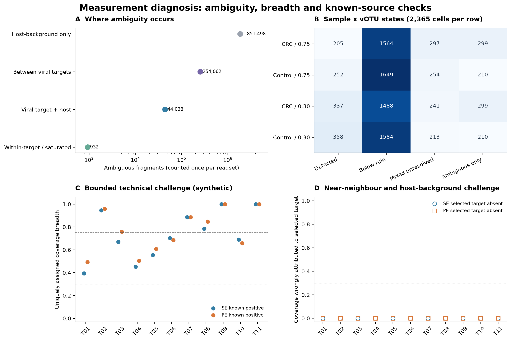
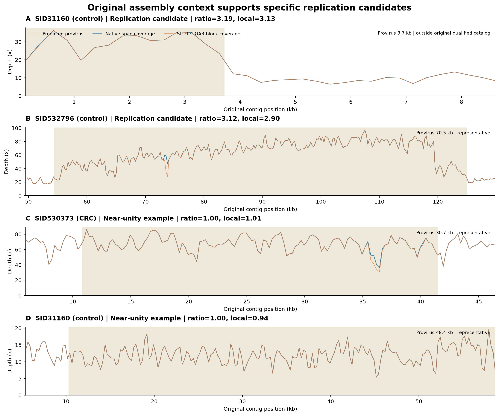
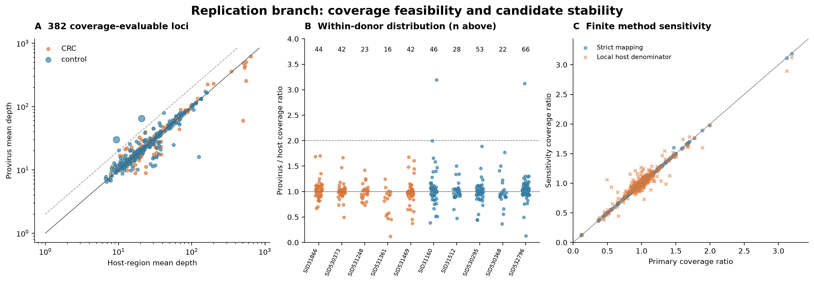

# 已有pilot：做了什么，得到什么，正式研究怎样使用

这是2026-10-08完成结果的交接展示，**不要求Jinlong复现或另跑先导**。历史报告和源表原样保存；其后续“少量新队列试跑”等旧执行建议已由当前全局计划替代。所有本报告数量已与底表对账，见[复核指标](pilot_verified_metrics.tsv)。

## 1. 输入与具体供者

参考258份：123 B. fragilis division I、19 B. hominis/历史division II、93 F. animalis、23 P. micra。它们不是258份CRC病例样本。

Feng队列10名供者：CRC为SID31866、SID530373、SID531248、SID531361、SID531469；研究对照为SID31160、SID31512、SID530295、SID530368、SID532796。对照按研究定义，不全称健康人。40 readsets、50个clean FASTQ在供者层合并测量。九队列并未全量完成。

## 2. 实际方法和参数

| 环节 | 已使用的方法及关键数值 | 证据入口 |
|---|---|---|
| reads QC | fastp0.24.0；最短50bp、qualified Phred20、unqualified百分比上限40；PE/SE与singleton按记录保留 | reads_preprocessing_dev_v1.json、逐人run_records |
| 去人源 | Bowtie2 2.5.4 very-sensitive-local；GRCh38-GENCODE-v47；identity≥.95、aligned-query≥.90、MAPQ门槛0、最多10比对；任一mate可信人源则去除该对 | 同一预处理profile及逐人parameters |
| 组装 | MEGAHIT1.2.9，最短contig500bp；QUAST5.3.0；Bowtie2原组装回贴；线程/内存曾按批次调整，不能从最后配置推断每人值 | method_sources/src_reads_v1、input_manifests及run_records |
| 病毒/prophage | geNomad与CheckV；原contig、区段坐标、侧翼和来源ID保留 | occurrence_evidence.tsv、run_records/06_viral_catalog |
| 联合目录 | 参考G＋10人M；95% ANI、85%较短序列覆盖聚类；主定量目录长度起点5kb，质量按成员原记录 | 源码viral_catalog.py与run_records |
| 直接G—M匹配 | ANI≥95%；双向双方覆盖≥85%为广泛匹配，只有短序列覆盖合格为片段匹配 | G_M_sequence_matches.tsv |
| 比对 | Bowtie2 end-to-end/very-sensitive，identity≥0.95、aligned-query≥0.90、MAPQ≥20、baseQ≥20、-k20；PE overlap按碱基并集；重复reads保留 | pilot10_measurement_profile.json |
| 检出 | 病毒全长至少75%位置深度≥1；无额外均深门槛，至少1个归属fragment；不含宿主侧翼；归属歧义有独立状态 | pilot10_detection_profile.json |
| 宿主profile | MetaPhlAn4.2.4，固定vJan25数据库，10人 | postpilot_diagnostics/03_host_profile与数据库adapter |
| PHROGs | pyhmmer HMM搜索；序列E和独立domain E≤1e−5，model覆盖≥0.4；PHROGs v4/38880模型；结果展示accepted且best命中 | core_functions.py、viral_functions.py |
| defense/anti-defense | DefenseFinder体系和3.1.0模型，包含anti-defense模型；系统与基因分别连接，保留位置 | core_functions.py及系统结果 |
| 代谢同源 | KOfam/KO同源输出，作为cargo候选证据 | viral_kofam.py、database_manifest |
| 复制活动 | PropagAtE1.1.0固定commit d67f6f74de2b20290339ad7fc7721e6bf02c8f1a；identity0.97、比2、Cohen d0.7、病毒均深≥1/广度≥0.5、末端mask150bp | replication_activity.py、completed.json |
| 项目额外复制资格 | 宿主可用长度≥1000bp、均深≥1、广度≥0.5；严格比对与邻近±5kb分母敏感性 | locus_diagnostics.tsv |

软件工具版本与数据库版本分开记录。例如geNomad工具/数据库不是同一个数字；以实际runtime manifest/数据库哈希为准。相关源码和历史配置在[方法源码目录](method_sources/)，它们是证据快照，不是给新服务器直接提交的脚本。

## 3. 两端能连起来吗

参考端812条原始病毒候选，其中541个预测provirus位点；患者端10683条原始病毒实例，其中382个预测provirus位点。合计11495条实例、11472条去重序列，合格联合定量目录473个vOTU。实例、序列和vOTU是不同层级。

得到1051条直接G—M序列匹配：20条双方覆盖达标的广泛匹配、1031条局部/片段匹配。广泛匹配连接19条参考病毒序列与7条患者病毒序列；不是20个独立病毒，更不是20个显著病例信号。展开到菌株/样本的多对多宿主链接有1066行，用于追溯而非增加独立证据数量。

这证明参考与患者两端可以建立真实序列连接；后续把患者上下文与宿主分类结合，可进一步确定匹配对应的宿主/整合解释。

图为描述性流程与实例分布，不对发现数量添加疾病显著性。

图展示序列匹配和参考来源，参考菌名不能直接视为患者内宿主实验验证。

## 4. 5＋5的差异检验结果

统计单位为10名供者。473个vOTU中342项检出比较可做双侧Fisher检验，473项丰度可做精确秩置换检验，合计815项。原始P<0.05分别1项和19项；联合BH校正后的Q全部为1。131项检出比较因有效信息不足为NA。丰度效应给出Cliff's delta及组内中位数，未假设两组没有生物学差异。

397/473个vOTU只在0或1人达到广泛检出，提示正式研究应增加独立患者和队列并预先做信息过滤。后续扩量有利于估计和重复验证，结果方向及显著对象数量由数据决定。

效应图已有原始P/Q和完整底表：[473个vOTU结果](pilot10/exploratory/votu_differential.tsv)。描述性图未做相应检验，不标ns或强加星号。

## 5. 功能和prophage证据已经做到哪一步

PHROGs、防御/反防御系统及KO同源的具体序列—基因连接已完成。下面是交集功能表的行数，单位是证据行，不能直接比较类别丰度或相加当独立基因数。

| 证据类型 | 表中行数 |
|---|---:|
| Antidefense | 6 |
| Defense | 1 |
| KO_homology | 55 |
| PHROG_homology | 585 |

并未完成全人群功能基因携带/丰度差异或AMG机制验证。后续优先审阅有序列和病毒上下文支持的候选；本次交接不自动新增全量毒力/耐药分析。DefenseFinder的部分原始hmmer_results临时目录已按授权清理，基因/系统/配置等结果保留；若要重看相应原始HMM细节需按原版本重跑，不声称有完整备份。

位点证据按caller、边界、CheckV、宿主侧翼marker、跨界reads和结构分别列。后续实验负责确定选定对象的切出、胞外颗粒和机制；这是从计算筛选到实验验证的正常分工。

## 6. 试跑后诊断的新收获

宿主profile显示B. fragilis在3/5 CRC与3/5对照有信号；F. animalis 1/5与0/5；P. micra 4/5与0/5；F. prausnitzii 5/5与5/5；R. intestinalis 4/5与5/5。B. hominis标签缺口为NA，不是没有该菌。profile信号和患者内prophage宿主归属分开。

涉及病毒的歧义片段主要来自病毒—病毒共享（254062），其次病毒—宿主背景（44038），另有932个同目标/搜索饱和；host-only1851498不能都当丢失病毒reads。75%规则有457个供者×vOTU检出单元，30%为695个，增加238个单元而不是238种病毒。

11个目标的技术模拟：75%时SE5/11、PE6/11；30%时两布局均11/11。测试困难阴性背景未产生该目标的错误覆盖，解释仅限这些目标和条件。正式研究无需大范围扫描阈值，可由Jinlong根据成熟方法和这里的测量经验选择并记录。

## 7. 已经找到可追踪的复制活动对象

382个位点均可评价覆盖，其中153个位点进入原合格目录。2个位点显示与活跃复制相容的覆盖特征，均来自对照。优先实例为SID532796、约70.486kb、votu_460353d4d5133754bc17、occ_6490c24bbc8d472e47dbd3aa62bd61f3：主覆盖比3.121，严格比对3.114，局部分母2.896，有双侧宿主marker。另一个SID31160约3.709kb短候选未进合格目录，先复核身份和结构。

后续可用更多样本、可培养参考和关键实验继续支持其活动与生物学解释。这两条提供具体对象；疾病方向由正式跨队列分析决定。

## 8. 对正式项目的直接影响

保留开放患者发现与参考支撑；不把交集设为唯一入口。加强病毒共享片段和宿主可测性，分别记录主检出、部分信号、丰度和复制活动。参考扩充覆盖其他宿主和谱系，不能只挑pilot阳性。正式参考和联合目录各自冻结；统计家族和保留验证规则前置。

Jinlong可以采用自己的流程、不复用任何计算；只需记录新旧方法差异和实际值。以前的结果不用追求数字完全复现，也不增加新先导门槛。

## 9. 如何追溯一个真实对象或一张图

以occ_6490c24bbc8d472e47dbd3aa62bd61f3为例：在[位点表](postpilot_diagnostics/05_replication_activity/locus_diagnostics.tsv)查覆盖和vOTU；在[pilot实例表](pilot10/prophage_evidence/occurrence_evidence.tsv)查原contig、start0/end0、序列/侧翼哈希；在[图源数据](postpilot_diagnostics/07_figures/source_data/)查绘图输入；对应[绘图代码](postpilot_diagnostics/02_pipeline/make_figures.py)。宿主最终物种仍需后续归属，不能由实例编号猜测。

原始代码含历史路径，公开副本用逻辑别名替换；本地保留原文和哈希。新服务器重画可使用[独立重画脚本](../03_execution/tools/redraw_replication.py)，输入当前打包的位点底表，不依赖旧服务器。原图完整重画代码也已保留，其路径入口需配置。图/表中的真实数据不随公开路径脱敏改变。
