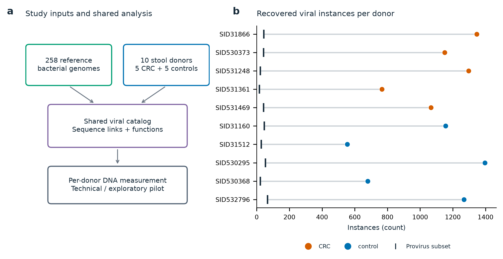
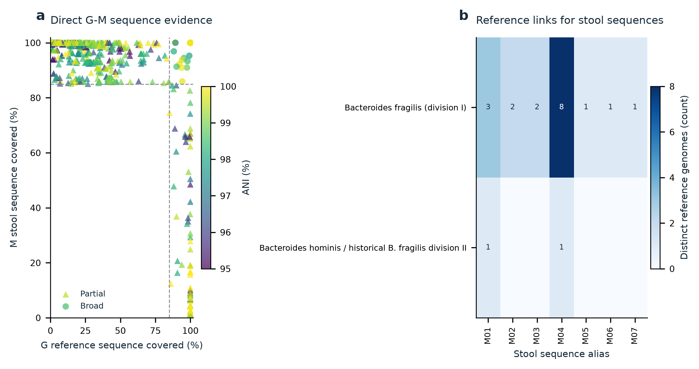
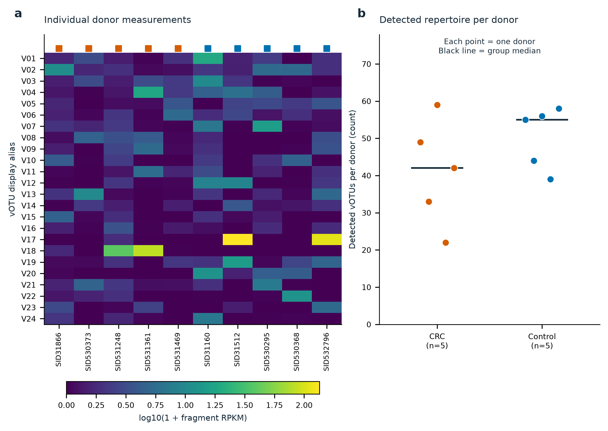
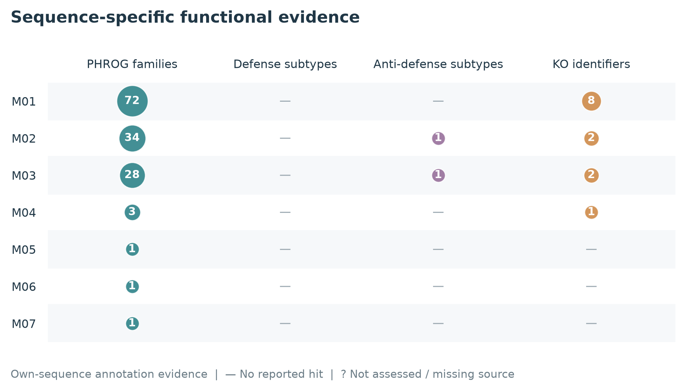
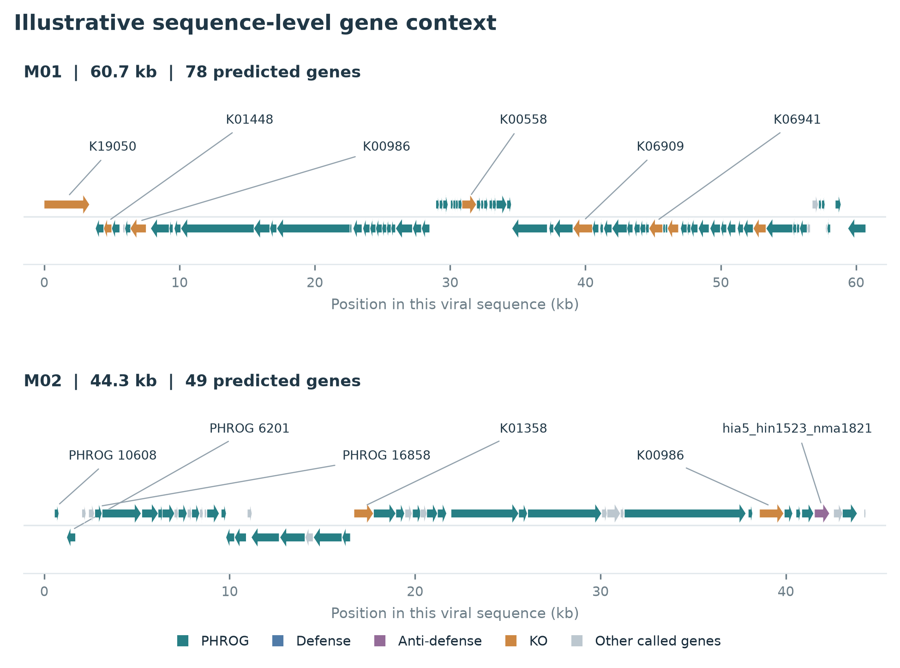
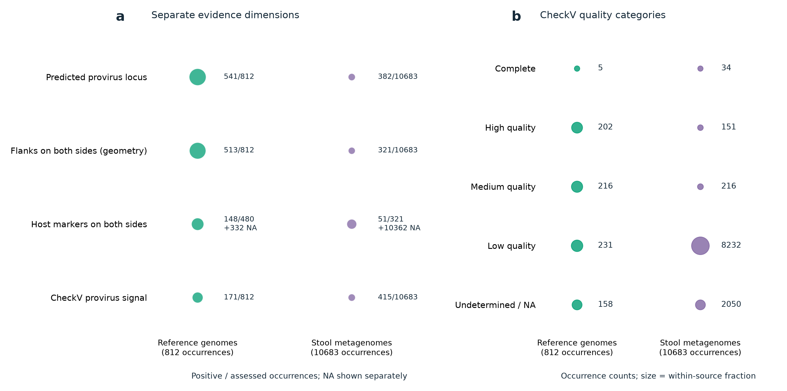
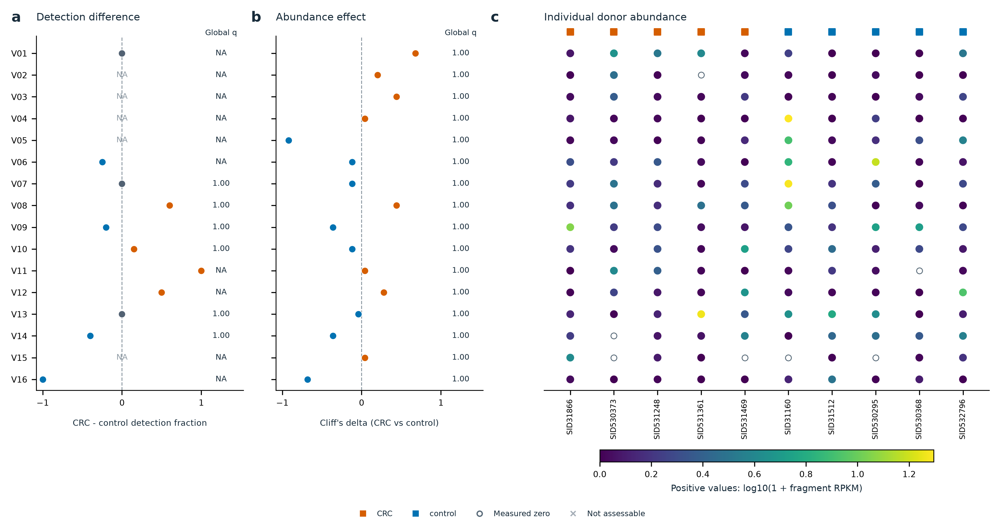

# CRC-PHIRE：完整十人先导结果报告

本次纳入258份参考genome与10名供者（5例CRC、5名研究对照）。统一目录保留11495条来源实例，其中923条为caller预测的provirus位点。473个vOTU进入统计结果表；其中产生815项可计算检验。

这是单队列、小样本、探索性先导。预测位点、完整性、患者reads检出与可诱导性是不同证据；现有计算不能证明真实完整可诱导的噬菌体。功能注释连接不是患者中的功能表达或功能差异检验。原五图描述模块与新增差异模块共同构成本次报告。

**计算已完成；原七张图已完成视觉检查。此次补充统计结论和逐图说明，不重算或改变任何分析结果。**

## 显著性结论：做了检验，但没有通过全局校正的差异

**已经完成差异检验，但没有检验通过预设的全局 BH 校正阈值 Q≤0.05。检出率与丰度合计 815 项有效检验，全部可计算的全局 Q 值均为 1.00。不能把这一结果写成“CRC 与对照没有生物学差异”。**

| 比较内容 | 实际检验数 | 原始 P＜0.05 | 全局 Q≤0.05 | 未检验数 |
|---|---:|---:|---:|---:|
| 检出率差异 | 342 | 1 | 0 | 131 |
| 丰度差异 | 473 | 19 | 0 | 0 |

原始 P＜0.05 的检出率比较有 1 项，丰度比较有 19 项；两类端点去重后涉及 19 个 vOTU。同一 vOTU 可以贡献两项检验。这些只能称为未校正的探索性线索，不能称为通过多重检验校正的显著差异。

统计单位是供者：5例 CRC 与5名研究对照，不是40个 readsets 或258份参考 genome。检出率采用双侧 Fisher 精确检验；丰度采用双侧精确秩置换检验。两个端点的全部有效 P 值合并为一个 BH 校正家族。缺失测量不当作零。

P 值反映单项检验与零假设的相容程度；同时检验大量对象时，需要使用校正后的 Q 值判断是否达到本项目的阈值。Q=1.00 不表示差异为零，也不表示零假设为真的概率为100%。不因本次没有显著结果而事后放宽阈值、删掉其他检验或改用未校正 P 值宣布发现。

131 个 vOTU 的检出率比较因至少一组不足3名可评估供者而未检验，显示 NA；这与“完成检验但不显著（ns）”不同。丰度使用各自的有效测量条件，因此其可检验数与检出率不必相同。

图1—6展示流程、序列连接、逐人测量、功能与证据质量，没有完成相应的组间显著性检验。不要把这些图没有星号理解为已经检验且不显著。尤其图3的每人检出总数只作描述，图4的功能命中也不是组间功能差异检验。图7才展示已有 vOTU 组间统计。

本次统计对象是进入定量的473个病毒 vOTU，需结合单独的 prophage 证据列解释，不能一概称为473个已证实、完整、可诱导的 prophage。本次也没有完成宿主丰度校正，差异不能直接归因于独立的噬菌体作用。

这轮先导已回答数据能否贯通、两端序列能否连接、能否定量并关联功能证据。5＋5的单队列结果尚不足以确立稳定的疾病关联；目前也不能据此判定项目无意义。后续应按预先确定的纳入标准增加独立供者、完成跨队列验证，并结合效应方向、宿主背景与 prophage 证据复核候选。不能承诺扩大样本后一定出现显著结果。

## 如何阅读

先查看全部七图，再按下方数据表核对每个候选。P值、全局BH校正Q值和效应大小一起读；无显著差异不能证明无生物学差异。宿主背景竞争序列不等于完成宿主丰度校正。

## 数据和方法入口

- [原始交集与流程验收](pilot10_final_acceptance.json)
- [逐条prophage证据](prophage_evidence/occurrence_evidence.tsv)
- [vOTU证据汇总](prophage_evidence/votu_evidence.tsv)
- [全部探索性差异](exploratory/votu_differential.tsv)
- [逐人分析值](exploratory/donor_analysis_values.tsv)
- [功能注释连接](exploratory/differential_function_links.tsv)
- [候选边界reads支持](candidate_review/junction_read_support.tsv)
- [边界重复候选](candidate_review/boundary_repeat_candidates.tsv)
- [候选基因位置和功能](candidate_review/candidate_gene_context.tsv)
- [统计方法说明](exploratory/探索性差异分析说明.html)
- [基础五图报告](图文结果报告.html)
- [补充两图报告](先导补充图文报告.html)

## 研究输入与逐人发现概览

> 描述性图：未进行本图所示发现数量的组间显著性检验。

圆点是每人组装得到的原始病毒实例数，竖线是其中预测provirus位点数。两者不是两个独立集合；原始病毒实例不能全部称为prophage。数量受测序深度和组装能力影响，不能直接解释为疾病差异。

All fixed donors; zeros retained.

## 两端的序列交集与参考菌株连接

> 描述性图：展示序列连接证据，不是 CRC 与对照的差异检验。

左图包含通过既定初筛的直接G–M序列对，可能有重叠点；不是所有未匹配对的分布。右图按参考分类单元和患者病毒序列展示连接，每格按不同参考genome去重计数，不将展开的多对多对应行当独立证据。这里的菌名表示参考端来源，不能证明患者体内宿主。

Up to16 broad-matched M sequences, sorted by pooled distinct-donor count, then length, then ID. No ranking by CRC effect.

## 逐人的病毒谱与检出情况

> 描述性图：右侧每人检出总数未做组间检验；不标 ns，也不标显著性星号。单个 vOTU 的检验见图7和完整统计表。

热图展示按全体供者合并检出人数、合并平均丰度及编号排序的前24个vOTU，未按CRC差异挑选。灰色是未评估，低丰度与零值使用同一连续色阶。右图每个点是一名供者，短横线是中位数；展示全部目录中的检出数量。检出计数受测序和宿主背景影响，图中没有显著性检验或因果含义。

Up to24 pooled-detection-ranked vOTUs; all donors retained. Full unfiltered tables preserved.

## Sequence-specific functional evidence

> 功能注释图：未做防御、反防御、PHROGs 或 KO 的组间功能显著性检验。

每行是一条宏基因组来源病毒序列；圆点面积随该序列上不同功能标签数增加，数字给出实际数值。PHROG仅计accepted=true且is_best=true的同源家族；防御和反防御计不同系统亚型，KO计不同KO编号，四列的统计单位并不相同。“—”表示没有报告该类命中，“?”表示未评估或来源表缺失；均不能解释为生物学缺失。这些是序列自身的计算证据，KO不是已确认AMG，系统命中不是机制验证。不从相似参考序列转移注释，不进行组间功能显著性检验。

At most 16 broad-matched M sequences selected by pooled donor count, then length and ID; no CRC contrast ranking.

## Illustrative sequence-level gene context

> 结构示意图：候选按既定展示规则选择，不是按显著 P/Q 值选出的疾病标志物。

展示最多两条广泛匹配宏基因组病毒序列的自身基因坐标和方向；在先前按全体供者出现次数筛选的序列中按长度、编号排序选取，不按CRC与对照差异挑选。每个箭头是该序列实际预测的一个基因。颜色仅表示该基因自身的同源命中或系统成员证据，每条轨道最多标注六个基因；未着色不等于没有功能。同一基因可能有多类证据，所有类别保存在对应source-data表；颜色优先级为反防御、防御、KO、PHROG，仅用于显示。仅从系统表提供的实际gene ID连接系统成员。这些是未经过人工机制审查的展示实例，不是已确认实验候选；图中没有同源基因连线、序列共线性或宿主侧翼，不据此认定AMG、prophage整合或患者体内宿主。

Among the pooled-occurrence display set, choose up to two sequences by descending length, then ID; require every coordinate to be valid.

## 按来源查看 prophage 证据与序列质量

> 证据质量图：各行是证据维度，不是疾病效应或显著性等级。

左图的每一行是独立证据维度，数字为阳性数／可评估数，另列 NA；不是从低到高的真伪等级，也不能将行数相加。两侧几何侧翼只表示序列空间，不能自动称为细菌侧翼。CheckV 未报告 provirus 不等于否定 geNomad 的预测。右图按原始出现实例统计质量类别；无法确定质量单独保留，不视为零质量。参考端与宏基因组端各有自己的分母，同一病毒可在多个来源出现，实例数不等于独立 vOTU 数。

All accepted occurrence rows, grouped by source; evidence dimensions and quality shown separately.

## 检出与丰度的探索性组间比较

> 显著性结论：全体815项有效检验均未达到全局 Q≤0.05，所有有效 Q 均为1.00（ns）。图中 NA 是未检验，不是 ns；效应点偏离零不等于统计显著。仅展示按合并检出比例选出的16个 vOTU，不代表全部473个对象。检出率最小原始 P=0.0476，丰度最小原始 P=0.0079；原始 P 值不能替代全局 Q 值。

最多展示 16 个 vOTU，按全部供者合并的检出比例降序、再按 vOTU 编号排序，未按 P 值、q 值或 CRC 效应选择。左侧为 CRC 减对照的检出比例差，中间为丰度的 Cliff’s delta；没有置信区间输入，因此不画误差线。两列 q 值均来自全部 vOTU 的检出与丰度两个端点合并后的全局 BH 校正，不采用逐端点 q 值。右侧每列一名供者，空心圆是有效测得的零，灰叉是不可评估，彩点是正丰度。分母和缺失原因见源表。本批发现与测量使用同一批样本，小样本差异只能用于提出假说；这不是独立验证、宿主校正效应或患者功能基因表达。

Pooled detection prevalence descending, then vOTU ID; at most 16, never ranked by P/q/effect.

## 候选复核说明

预先按参考交集、序列质量和合并检出情况选择最多20条宏基因组provirus实例，本次复核20条。选择不依据P值。原组装reads跨越预测边界仅支持局部组装连续性；边界附近重复仅作序列复核线索，不能认定att位点、切出或诱导。
